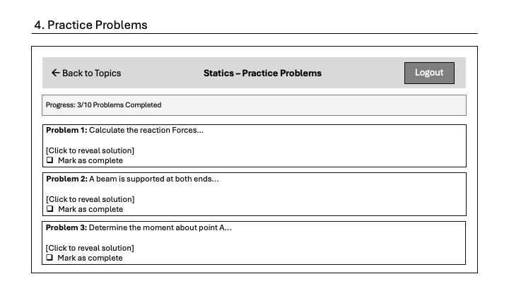
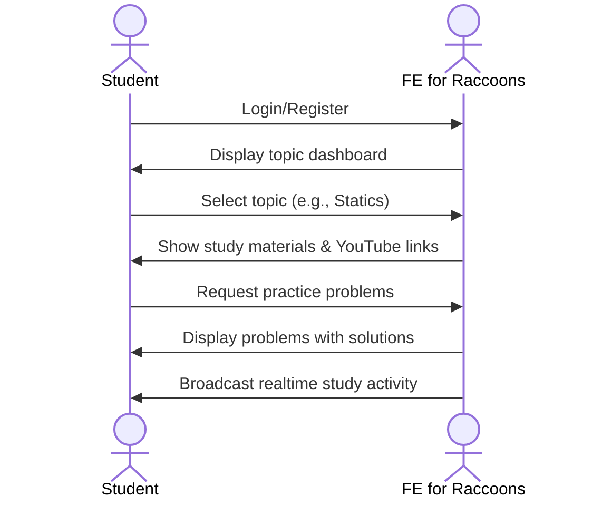

# FE for Raccoons

[My Notes](notes.md)

FE for Raccoons is a study platform for the Fundamentals of Engineering (FE) Exam. It consolidates study materials, practice problems, and video tutorials into one organized web application, eliminating the need to search through multiple textbooks and scattered online resources.

## 🚀 Specification Deliverable

For this deliverable I did the following. I checked the box `[x]` and added a description for things I completed.

- [x] Proper use of Markdown
- [x] A concise and compelling elevator pitch
- [x] Description of key features
- [x] Description of how you will use each technology
- [x] One or more rough sketches of your application. Images must be embedded in this file using Markdown image references.

### Elevator pitch

Studying for the FE (Fundamentals of Engineering) Exam is a challenge. You need to juggle textbooks, scattered YouTube videos, and practice problems from different sources. **FE for Raccoons** consolidates everything: _study materials, practice problems, and tutorials_. All into one platform so you can focus on passing instead of searching.

### Design

*Login/Register page with simple authentication form*

*Dashboard showing FE exam topics with progress tracking and live activity*

*Study materials with key concepts and embedded YouTube tutorial*

*Practice problems interface with solutions and completion tracking*

### Key features

- Browse FE exam topics organized by category (Statics, Dynamics, Fluid Mechanics, etc.)
- Access study materials and concept summaries for each topic
- Complete practice problems with detailed solutions
- Curated YouTube tutorial links for visual learning
- Track personal study progress and completed topics
- View realtime activity showing what topics other users are currently studying
- Secure user authentication and personalized dashboard

### Technologies

I am going to use the required technologies in the following ways.

- **HTML** - Structured 4 pages for login, topic dashboard (list of FE exam categories to choose from), study view (study materials, YouTube embed, and button to access practice problems for selected topic), and practice problems (its own page with problems and solutions). Proper semantic HTML with navigation links between pages.

- **CSS** - Responsive styling that works on desktop and mobile. Minimalist color scheme using pale off-white and dark grey tones to avoid distracting from study content, with good contrast for readability. Clean layout for topic cards and content organization.

- **React** - Single-page application with components for topic cards, study content display, practice problem sets, and progress tracking. React Router for navigation between views. Reactive UI updates as users interact with study materials.

- **Service** - Backend service with endpoints for:
  - Retrieving topic lists and study materials
  - Fetching practice problems
  - Saving and retrieving user progress
  - User authentication (register, login, logout)
  - Third-party service call to fetch motivational quotes or additional educational content

- **Database/Login** - Store user credentials securely in MongoDB. Store user study progress, completed topics, and preferences. Authentication required to access study materials and track progress.

- **WebSocket** - Realtime display of active study sessions. Shows which topics other users are currently studying (e.g., "5 users studying Fluid Mechanics") to create a sense of community and motivation.

## 🚀 AWS deliverable

For this deliverable I did the following. I checked the box `[x]` and added a description for things I completed.

- [x] **Server deployed and accessible with custom domain name** - [My server link](https://startup.fe4raccoons.click).

## 🚀 HTML deliverable

For this deliverable I did the following. I checked the box `[x]` and added a description for things I completed.

- [x] **HTML pages** - 4 pages: index.html (login), dashboard.html (topics), study.html (study materials), problems.html (practice problems)
- [x] **Proper HTML element usage** - Used semantic elements: header, main, footer, nav, section, form, details
- [x] **Links** - Navigation between all pages, back links, logout, GitHub repo link
- [x] **Text** - All pages contain descriptive text, instructions, problem descriptions
- [x] **3rd party API placeholder** - Motivational quotes section in problems.html with placeholder text
- [x] **Images** - Placeholder for YouTube video embed in study.html
- [x] **Login placeholder** - Username/password form in index.html
- [x] **DB data placeholder** - Study materials, problems, progress tracking all marked as DB placeholders
- [x] **WebSocket placeholder** - Live Activity section in dashboard.html showing real-time user activity

## 🚀 CSS deliverable

For this deliverable I did the following. I checked the box `[x]` and added a description for things I completed.

- [x] **Visually appealing colors and layout. No overflowing elements.** - Custom color palette with cream background, charcoal text, and accent colors. Clean, professional layout with proper spacing.
- [x] **Use of a CSS framework** - Tailwind CSS imported via `@import 'tailwindcss'` in main.css
- [x] **All visual elements styled using CSS** - All buttons, inputs, cards, headers, footers, and page layouts fully styled. Modular CSS structure with main.css for shared styles and separate CSS files for each page (index.css, dashboard.css, study.css, problems.css).
- [x] **Responsive to window resizing using flexbox and/or grid display** - Grid layout for topics (.topics-grid) and page headers. Flexbox for login buttons and header layout. Media queries for mobile responsiveness at 992px and 640px breakpoints.
- [x] **Use of a imported font** - Inter font family from Google Fonts
- [x] **Use of different types of selectors including element, class, ID, and pseudo selectors** - Element selectors (body, button, input), class selectors (.topic-card, .logout-btn), ID selector (#app-title, #app-slogan), pseudo selectors (:hover, :focus, :active, :before, :last-child)

## 🚀 React part 1: Routing deliverable

For this deliverable I did the following. I checked the box `[x]` and added a description for things I completed.

- [x] **Bundled using Vite** - Application uses Vite for bundling and hot-reloading during development. Uses Tailwind CSS for styling.
- [x] **Components** - Created React components for Login, Dashboard, Study, and Problems views. All components contain converted HTML/CSS from previous deliverable
  - Login component: login form with username/password inputs, navigation to dashboard on login/register
  - Dashboard component: topic selection grid with 6 topics, live activity section, topic cards navigate to study page
  - Study component: key concepts list, video placeholder, practice button navigates to problems page
  - Problems component: 5 math problems with collapsible solutions, completion checkboxes, motivational quote section
- [x] **Router** - React Router implemented with routes for / (Login), /dashboard (Dashboard), /study (Study), /problems (Problems), and * (404 page). Navigation works via useNavigate hook in all interactive buttons.

## 🚀 React part 2: Reactivity deliverable

For this deliverable I did the following. I checked the box `[x]` and added a description for things I completed.

- [ ] **All functionality implemented or mocked out** - I did not complete this part of the deliverable.
- [ ] **Hooks** - I did not complete this part of the deliverable.

## 🚀 Service deliverable

For this deliverable I did the following. I checked the box `[x]` and added a description for things I completed.

- [ ] **Node.js/Express HTTP service** - I did not complete this part of the deliverable.
- [ ] **Static middleware for frontend** - I did not complete this part of the deliverable.
- [ ] **Calls to third party endpoints** - I did not complete this part of the deliverable.
- [ ] **Backend service endpoints** - I did not complete this part of the deliverable.
- [ ] **Frontend calls service endpoints** - I did not complete this part of the deliverable.
- [ ] **Supports registration, login, logout, and restricted endpoint** - I did not complete this part of the deliverable.

## 🚀 DB deliverable

For this deliverable I did the following. I checked the box `[x]` and added a description for things I completed.

- [ ] **Stores data in MongoDB** - I did not complete this part of the deliverable.
- [ ] **Stores credentials in MongoDB** - I did not complete this part of the deliverable.

## 🚀 WebSocket deliverable

For this deliverable I did the following. I checked the box `[x]` and added a description for things I completed.

- [ ] **Backend listens for WebSocket connection** - I did not complete this part of the deliverable.
- [ ] **Frontend makes WebSocket connection** - I did not complete this part of the deliverable.
- [ ] **Data sent over WebSocket connection** - I did not complete this part of the deliverable.
- [ ] **WebSocket data displayed** - I did not complete this part of the deliverable.
- [ ] **Application is fully functional** - I did not complete this part of the deliverable.
