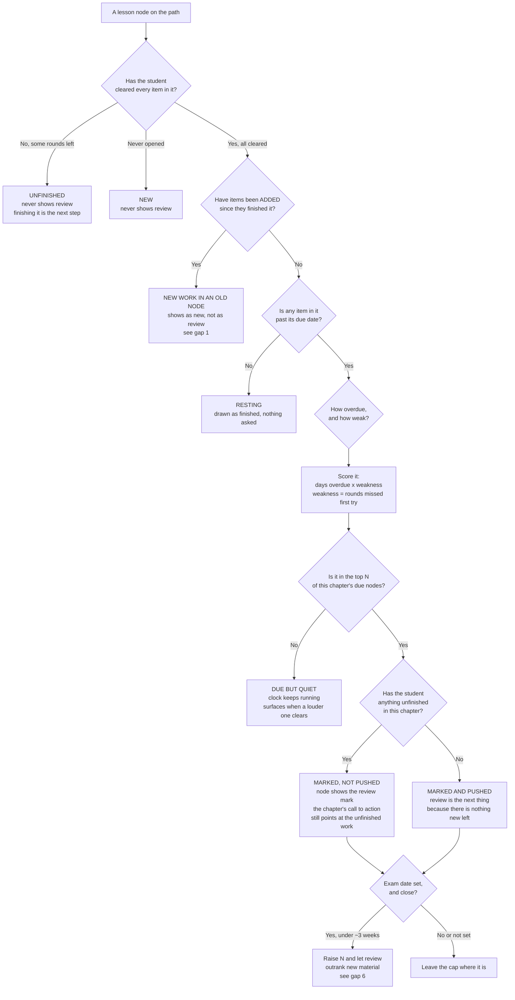

# Which nodes ask to be revisited, and when

**PARKED on 2026-09-12, the day it was written. Not built, and not being
built.** See [ADR 0014](../adr/0014-no-scheduled-review-on-the-phone.md): nine
interlocking rules, every one of them a guess, and no game events in
production to check any of them against. The phone schedules nothing. A
student who wants to run an item again taps it.

Kept because the thinking is the expensive part, and the question is worth
answering once real sittings exist. Read it as a starting point, not a spec:
the gap list at the bottom is the most useful half.

Working design note for the mobile chapter path, written while deciding what
replaces the Review tab.

## The one-sentence version

A node can ask to be revisited only after it has been finished, only a few
nodes per chapter may ask at once, and asking never takes priority over
material the student has not met yet.

## The tree

## What a revisit actually is

Tapping a marked node does not replay the whole item. It opens a short
sitting, three rounds, drawn first from the rounds the student did NOT get on
the first attempt, then from the rest. Option order and round order are
shuffled, so remembering "it was the third one" does not work.

Clearing that sitting pushes the item to the next rung of the ladder. A
sitting abandoned half way changes nothing.

## The ladder

Per ITEM, not per node. A node is due when its earliest-due item is due.

| Rung | Next visit | Moves up when |
|---|---|---|
| 1 | 2 days | the sitting is cleared |
| 2 | 1 week | the sitting is cleared |
| 3 | 3 weeks | the sitting is cleared |
| 4 | 2 months | the sitting is cleared |

A round missed during a revisit drops that item one rung, never below rung 1.

## The cap

At most **three** nodes per chapter carry the mark at once, chosen by days
overdue times weakness. The rest stay due underneath and appear as the loud
ones clear. The Study tab carries a total ("6 to revisit") so the backlog is
never hidden, only quiet.

## Gaps, in the order they worry me

1. **Items added to a finished lesson.** We added six items to lessons that
   students may already have finished. The tree says draw those as NEW rather
   than as review, because they have never been seen, but the node is already
   green. Nothing in the current model distinguishes "green because you did
   everything" from "green because you did everything there was in June".
   Probably the node needs to fall back to unfinished, with a marker that says
   what is new.

2. **Leeches.** An item that keeps being missed will sit on rung 1 and ask
   every two days forever. At some point that is nagging rather than teaching.
   Proposal: after three failed revisits, rest it for a month and say so, with
   a line pointing at the lesson on the website.

3. **Abandoned chapters.** A student who did two chapters in June and left will
   open the app to a wall of marks. Proposal: due-ness ages out after, say,
   twelve weeks of no activity in that chapter, and the chapter shows one line
   offering a fresh start instead of thirty individual asks.

4. **Where the clock lives.** The phone records which rounds were cleared, not
   when. Timestamps are in the server event log, so due-ness has to be computed
   there and sent with the path. Offline play then needs a rule for what the
   phone believes until it syncs.

5. **Local date, not elapsed hours.** "Two days" has to mean the student's own
   calendar days, the way the web streak already works, or someone playing at
   11pm gets asked again the next morning.

6. **The exam date.** The profile already holds one. A student sitting the exam
   in ten days should probably see review outrank new chapters, and one sitting
   it in a year should not. This is the piece of logic most obviously missing,
   and the one I would want your call on.

7. **Per chapter or across the app.** The cap above is per chapter, which keeps
   a path readable but means a student with five chapters going can have
   fifteen marks. A global cap is calmer and harder to explain.

8. **What "weakness" counts.** Rounds missed on the first attempt is the only
   signal we store today. Time-to-answer would be a better one and we do not
   record it.

## What this does not change

Mastery is unaffected. A revisit is a game round like any other: it moves the
games' own number and never the website's readiness figure.
